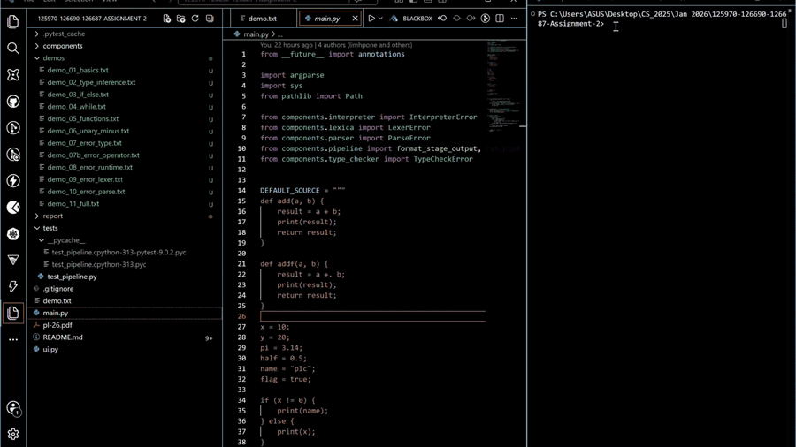
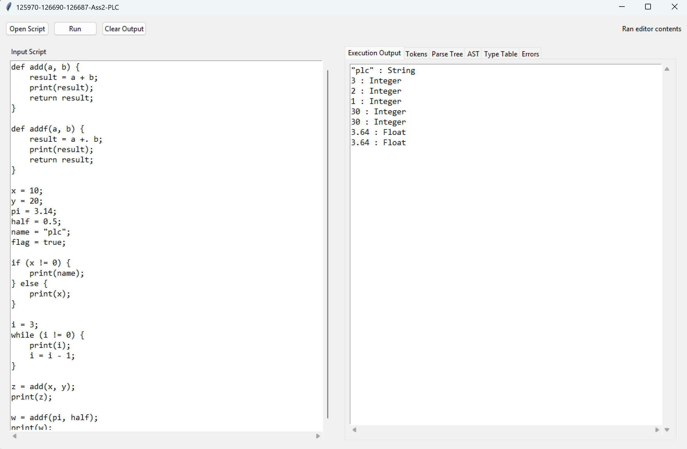
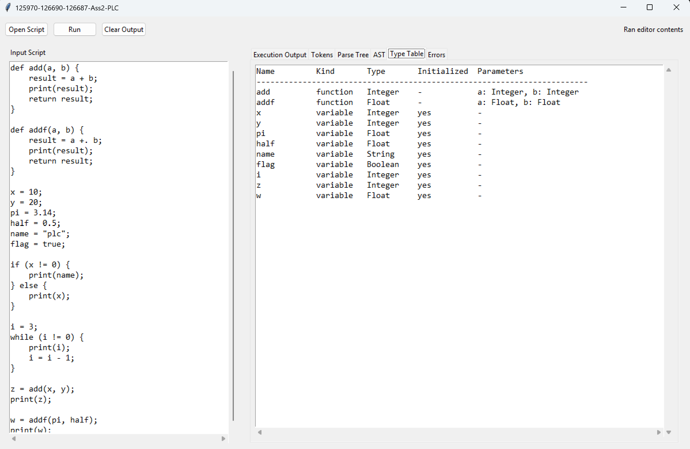
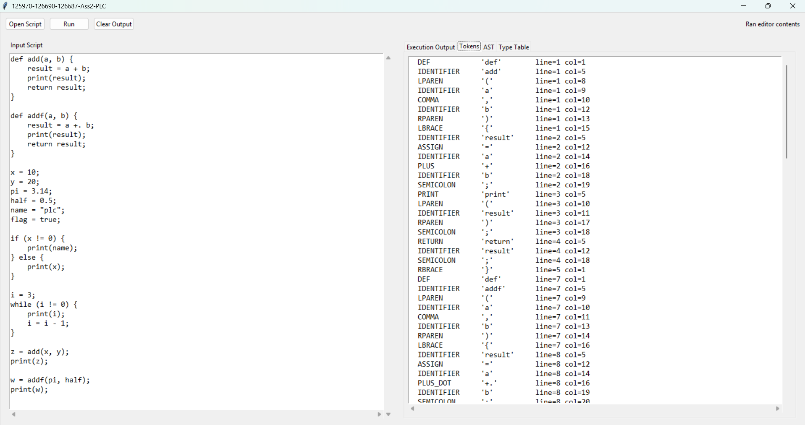
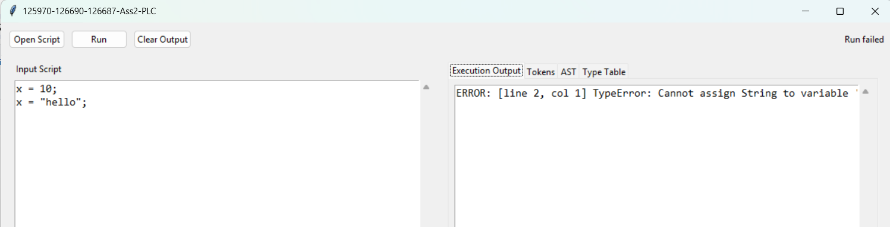
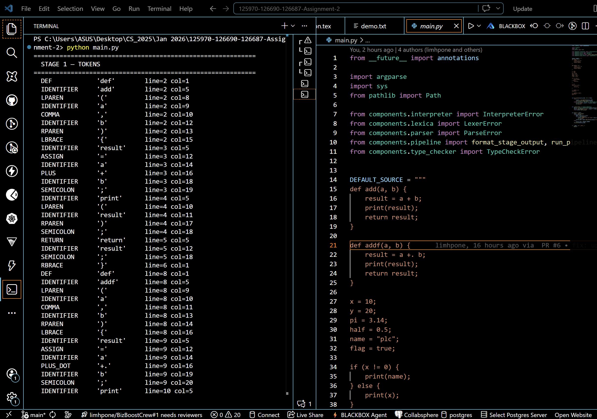
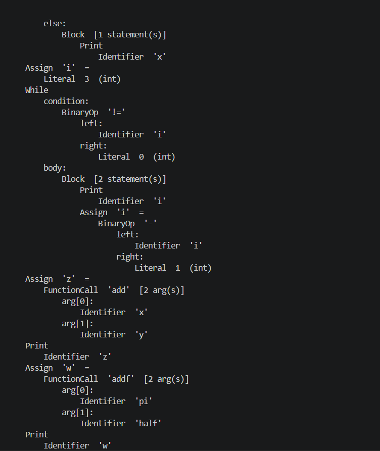
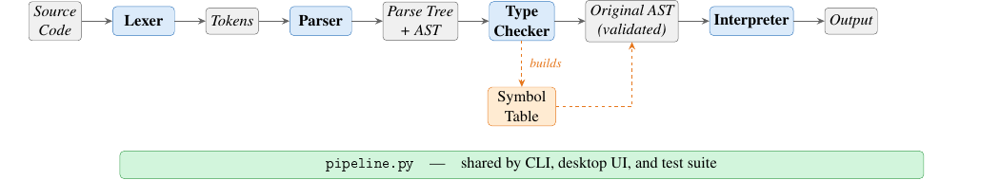

# 125970-126690-126687 — Programming Languages and  Compiler

<p align="center">
  <strong>AT70.07 · Programming Languages and Compilers</strong><br>
  Assignment 2 &nbsp;|&nbsp; Asian Institute of Technology &nbsp;|&nbsp; <em>The Token Trio</em>
</p>

<p align="center">
  <a href="https://github.com/The-Token-Trio/125970-126690-126687-Assignment2-PLC">
    
  </a>
  &nbsp;
  <a href="https://youtu.be/sR2JRm6eYzM">
    
  </a>
  &nbsp;
  
  &nbsp;
  
</p>

---

A statically-typed interpreted language built from scratch in Python — no external dependencies. The full compiler pipeline runs from raw source text through lexing, parsing, type checking, and tree-walking interpretation, with both a CLI and a desktop GUI exposing every stage for inspection.

---

## Team The Token Trio

| Name | Student ID |
| ---- | ---------- |
| Aye Khin Khin Hpone (Yolanda Lim) | st125970 |
| Applegate T. Tun Oo | st126690 |
| Win Htut Naing | st126687 |

---

## Demo

<p align="center">
  
</p>
<p align="center"><em>Full walkthrough on <a href="https://youtu.be/sR2JRm6eYzM">YouTube</a></em></p>

---

## Screenshots

### Desktop UI

<table>
  <tr>
    <td align="center" width="50%">
      <br>
      <sub><b>Execution Output</b> — values printed with inferred type</sub>
    </td>
    <td align="center" width="50%">
      <br>
      <sub><b>Type Table</b> — global-scope variables and functions with inferred types</sub>
    </td>
  </tr>
  <tr>
    <td align="center" width="50%">
      <br>
      <sub><b>Tokens</b> — full token stream with type, lexeme, line and column</sub>
    </td>
    <td align="center" width="50%">
      <br>
      <sub><b>Errors tab</b> — type error with exact line and column</sub>
    </td>
  </tr>
</table>

### CLI

<table>
  <tr>
    <td align="center" width="50%">
      <br>
      <sub><b>Stage 1 — Tokens</b></sub>
    </td>
    <td align="center" width="50%">
      <br>
      <sub><b>Stage 4 — Type Check &amp; Stage 5 — Execution</b></sub>
    </td>
  </tr>
</table>

---

## Language Features

| Feature | Detail |
| ------- | ------ |
| **Types** | `Integer`, `Float`, `Boolean`, `String` |
| **Typing** | Static · inferred on first assignment · no annotations needed |
| **Integer arithmetic** | `+` `-` `*` `/` (floor division) |
| **Float arithmetic** | `+.` `-.` `*.` `/.` — no overloading with integer operators |
| **Comparisons** | `==` `!=` between two same-type numeric expressions |
| **Unary minus** | `-x` and `-.x` (desugared to `0 - x` / `0.0 -. x`) |
| **Control flow** | `if` / `else` · `while` |
| **Functions** | Definition · value parameters · `return` · type-inferred parameters |
| **Built-in** | `print(expr)` — outputs `value : Type` |

---

## Pipeline

<p align="center">
  
</p>

```
Source code
    │
    ▼
  Lexer          →  STAGE 1: token stream
    │
    ▼
  Parser         →  STAGE 2: Parse Tree  +  STAGE 3: AST
    │
    ▼
  Type Checker   →  STAGE 4: symbol table with inferred types
    │
    ▼
  Interpreter    →  STAGE 5: execution output
```

All stages are wired through `components/pipeline.py` and shared by the CLI, desktop UI, and test suite.

---

## Quick Start

**Run the built-in sample program:**
```bash
python main.py
```

**Run a source file:**
```bash
python main.py demos/demo_01_basics.txt
```

**Open the desktop GUI:**
```bash
python ui.py
```

Use `python3` on macOS / Linux. No external packages required.

---

## Quick Example

```
def add(a, b) {
    result = a + b;
    return result;
}

x = 10;
y = 20;
pi = 3.14;
name = "plc";
flag = true;

if (x != 0) {
    print(name);
} else {
    print(x);
}

i = 3;
while (i != 0) {
    print(i);
    i = i - 1;
}

z = add(x, y);
print(z);
```

**Output:**
```
"plc" : String
3 : Integer
2 : Integer
1 : Integer
30 : Integer
```

---

## Project Structure

```
components/
├── tokens.py             Token model and TokenType enum
├── lexica.py             Lexer: source → list[Token]
├── symbol_table.py       Scoped symbol and type storage
├── ast_nodes.py          AST node dataclasses
├── parser.py             Recursive-descent parser
├── parse_tree_printer.py Grammar-oriented parse-tree renderer
├── ast_printer.py        AST pretty-printer
├── type_checker.py       Static type inference and checking
├── interpreter.py        Tree-walking interpreter
└── pipeline.py           Shared runner for CLI / UI / tests
main.py                   CLI entry point
ui.py                     Tkinter desktop UI
tests/test_pipeline.py    77 automated regression tests
demos/                    Demo scripts for each language feature
report/                   LaTeX source and compiled PDF
```

---

## Tests

```bash
python -m unittest discover -s tests -v
```

| Class | Stage | Tests |
| ----- | ----- | ----: |
| `LexerTests` | Tokenisation | 12 |
| `SymbolTableTests` | Scoped symbol table | 7 |
| `ParserTests` | Parsing and operator precedence | 7 |
| `TypeCheckerTests` | Type inference and error detection | 22 |
| `IntegrationTests` | Full pipeline execution | 29 |
| **Total** | | **77** |

---

## Error Reporting

Errors surface at the earliest possible stage with source position:

| Stage | Example |
| ----- | ------- |
| Lexer | `[line 2, col 5] LexerError: Unexpected '!'. Did you mean '!='?` |
| Parser | `[line 2, col 1] ParseError: Expected ';' after assignment` |
| Type checker | `[line 2, col 1] TypeError: Cannot assign String to variable 'x' of type Integer` |
| Interpreter | `[line 3, col 12] RuntimeError: Division by zero` |

---

## Contribution

| Name | Student ID | Assignment Scope |
| ---- | ---------- | ---------------- |
| Aye Khin Khin Hpone (Yolanda Lim) | st125970 | Static typing and type checking; tree-walking interpreter (assignment, if, while, function, `print()`); unary minus inference/execution; Desktop UI; CLI; pipeline integration; automated testing (77 tests) |
| Applegate T. Tun Oo | st126690 | Lexer implementation (character scanning, tokenisation, line/column tracking, error reporting); Token definitions; Keywords and operators; Identifiers and literals; Variable/function storage; Type storage |
| Win Htut Naing | st126687 | Arithmetic expressions (incl. unary minus); Boolean expressions; Assignment statements; If-then-else; While-loop; Function definitions and calls; `print()` syntax; parse-tree and AST construction |


